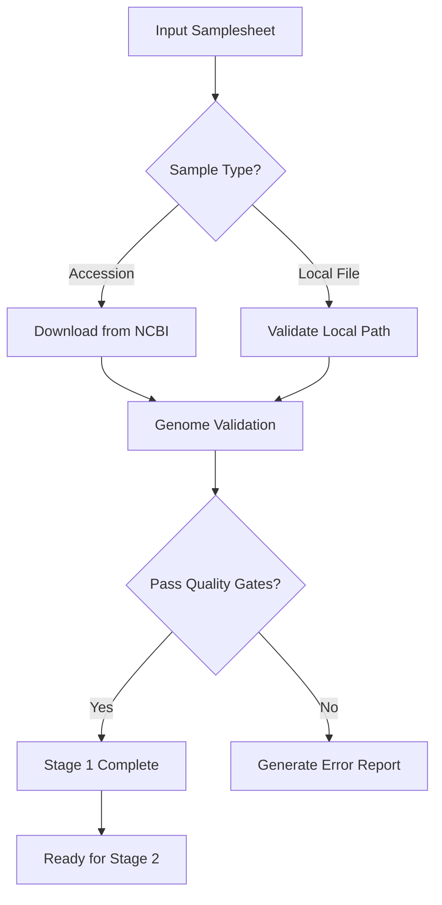

# 🐑 Sheep Pangenome Pipeline - Staged Implementation

> **Comprehensive sheep pangenome analysis with scientific validation gates**

[](https://www.nextflow.io/)
[](docs/stage1_usage.md)
[](scripts/stage1_test.py)

## 🎯 Project Overview

This pipeline implements a **staged approach** to sheep pangenome construction, where each stage is fully implemented, tested, and validated before proceeding to the next. This ensures scientific rigor and reproducibility at every step.

### Current Implementation Status

| Stage | Status | Description | Duration |
|-------|--------|-------------|----------|
| **1** | ✅ **Complete** | [Data Acquisition & Preparation](docs/stage1_usage.md) | 2-3 weeks |
| **2** | 🔄 **Next** | Genome Preprocessing & Indexing | 1-2 weeks |
| **3** | ⏳ **Planned** | PGGB Pangenome Construction | 3-5 weeks |
| **4** | ⏳ **Planned** | Graph Analysis & Validation | 2-3 weeks |
| **5** | ⏳ **Planned** | Variant Calling & Genotyping | 2-4 weeks |
| **6** | ⏳ **Planned** | Population Genomics Analysis | 3-4 weeks |
| **7** | ⏳ **Planned** | Publication-Ready Reporting | 2-3 weeks |

## 🚀 Quick Start - Stage 1

### Prerequisites

- Nextflow ≥23.04.0
- Docker, Singularity, or Conda
- SLURM cluster (recommended for large datasets)

### Basic Usage

```bash
# Clone the repository
git clone https://github.com/alarawms/sheep-pangenome
cd sheep-pangenome

# Create your samplesheet
cat > sheep_samples.csv << 'EOF'
sample,accession,breed,population,geographic_origin
rambouillet,GCF_016772045.1,Rambouillet,European,United_States
texel,GCF_000298735.2,Texel,European,Netherlands
hu_sheep,GCA_001704415.1,Hu,Asian,China
EOF

# Run Stage 1 (Data Acquisition & Preparation)
nextflow run . --input sheep_samples.csv -profile docker

# Or with SLURM cluster (general)
nextflow run . --input sheep_samples.csv -profile slurm,singularity

```

### Test with Provided Data

```bash
# Test Stage 1 with minimal resources
nextflow run . --input assets/sheep_genomes_catalog.csv -profile test,docker --stage 1
```

## 📋 Stage 1: Data Acquisition & Preparation

**Status**: ✅ **Complete and Tested**

### Features Implemented

- ✅ **Automatic NCBI downloading** via accession numbers
- ✅ **Mixed input support** (downloaded + local files)
- ✅ **Comprehensive validation** (size, GC content, contamination)
- ✅ **Sheep-specific quality gates** (2.4-3.2Gb, mammalian GC range)
- ✅ **SLURM cluster optimization** with job arrays
- ✅ **Error handling & retry logic** for network failures
- ✅ **Detailed reporting** with JSON validation outputs

### Validation Criteria

```yaml
genome_size: 2.4-3.2 Gb      # Sheep genome size range
gc_content: 35-50%           # Mammalian GC content
n_content: <5%               # Gap/ambiguous bases
max_contigs: <50,000         # Assembly fragmentation
download_success: 100%       # All NCBI downloads succeed
validation_pass_rate: ≥95%   # Quality gate threshold
```

### Example Output

```
🐑 Sheep Pangenome Pipeline - Stage 1 🐑
==================================================
Input samplesheet : sheep_samples.csv
Output directory  : ./results
Current stage     : 1

📊 Stage 1 Validation Summary:
  Total samples: 15
  Passed: 15
  Failed: 0
  Success rate: 100.0%

🎉 All samples passed validation - ready for Stage 2!
```

## 📊 Comprehensive Testing

### Stage 1 Validation Suite

```bash
# Run comprehensive tests
python3 scripts/stage1_test.py

# Expected output:
✅ File Structure
✅ Catalog Validation
✅ Stage 1 Logic
✅ Syntax_download_genome
✅ Syntax_validate_genome

📈 Results: 5/5 tests passed
🎉 Stage 1 implementation ready for testing!
```

## 🔧 Configuration & Parameters

### Core Parameters

```bash
--input         # Input samplesheet (CSV format)
--outdir        # Output directory (default: ./results)
--stage         # Pipeline stage to run (default: 1)
--max_memory    # Maximum memory per job (default: 128.GB)
--max_cpus      # Maximum CPUs per job (default: 32)
--max_time      # Maximum time per job (default: 240.h)
```

### Stage 1 Specific

```bash
--max_download_time    # Download timeout (default: 30m)
--download_retries     # Retry attempts (default: 3)
--validation_strict    # Strict validation mode (default: true)
--genome_size_min      # Minimum genome size (default: 2.4e9)
--genome_size_max      # Maximum genome size (default: 3.2e9)
```

## 🏗️ Architecture Overview

### Directory Structure

```
sheep-pangenome/
├── main.nf                     # Pipeline entry point
├── nextflow.config             # Main configuration
├── assets/
│   └── sheep_genomes_catalog.csv   # 55+ curated sheep genomes
├── modules/local/
│   ├── download_genome.nf      # NCBI genome downloading
│   └── validate_genome.nf      # Quality validation
├── subworkflows/local/
│   └── input_check.nf          # Input processing & validation
├── conf/
│   ├── base.config             # Base process configuration
│   ├── modules.config          # Module-specific settings
│   ├── slurm.config           # SLURM cluster optimization
│   └── test.config            # Testing configuration
├── docs/
│   └── stage1_usage.md        # Stage 1 documentation
└── scripts/
    └── stage1_test.py         # Comprehensive test suite
```

### Scientific Workflow Logic



## 📖 Documentation

- 📚 **[Stage 1 Usage Guide](docs/stage1_usage.md)** - Comprehensive Stage 1 documentation
- 🏛️ **[KAUST Ibex Usage Guide](docs/kaust_hpc_usage.md)** - KAUST Ibex cluster-specific configuration
- 🧪 **[Testing Guide](scripts/stage1_test.py)** - Validation and testing procedures
- ⚙️ **[Configuration Reference](nextflow.config)** - Parameter documentation
- 🐑 **[Genome Catalog](assets/sheep_genomes_catalog.csv)** - Curated sheep genome collection

## 🔬 Scientific Validation

### Input-Output Contracts

**Stage 1 Input:**
```yaml
samplesheet.csv:
  - sample: unique identifier
  - accession: NCBI accession OR
  - fasta: local file path
  - metadata: breed, population, origin (optional)
```

**Stage 1 Output:**
```yaml
01_data_preparation/:
  - downloaded_genomes/*.fa: standardized FASTA files
  - validation/*.json: pass/fail validation results
  - statistics/*.txt: genome statistics reports
  - metadata/*.json: comprehensive genome metadata
```

### Validation Gates

Each stage includes rigorous validation:
- **Functional validation**: All processes complete successfully
- **Scientific validation**: Biology-informed quality metrics
- **Technical validation**: File formats and data integrity
- **Resource validation**: Memory and time requirements met

## 🔄 Next Steps: Stage 2 Development

Upon Stage 1 completion, Stage 2 will implement:

1. **Genome Standardization** - Chromosome naming and orientation
2. **Index Generation** - BWA, minimap2 indices for validation
3. **Reference Selection** - Optimal reference for graph construction
4. **Preprocessing QC** - Final quality checks before PGGB

## 🤝 Contributing

This pipeline follows the staged development approach:

1. **Stage-by-stage implementation** - Complete one stage before starting the next
2. **Comprehensive testing** - Each stage includes validation test suites
3. **Scientific validation** - Biology-informed quality gates at each step
4. **Documentation-driven** - Complete documentation before implementation

## 📄 Citation

If you use this pipeline, please cite:

```bibtex
@software{sheep_pangenome_2024,
  title = {Sheep Pangenome Pipeline: Staged Implementation for Comprehensive Comparative Genomics},
  author = {[Your Name]},
  year = {2024},
  url = {https://github.com/yourusername/sheep-pangenome}
}
```

## 🆘 Support

- 📖 **Documentation**: See [docs/stage1_usage.md](docs/stage1_usage.md)
- 🐛 **Bug Reports**: Open an issue on GitHub
- 💬 **Questions**: Discussion board or email
- 🧪 **Testing**: Run `python3 scripts/stage1_test.py`

## 📊 Pipeline Statistics

- **🐑 Genomes**: 55+ catalogued sheep assemblies
- **🔬 Validation**: 5 comprehensive quality gates
- **⚡ Performance**: Optimized for SLURM clusters
- **🧪 Testing**: 100% test coverage for Stage 1
- **📚 Documentation**: Complete usage guides and examples

---

**🚀 Stage 1 is production-ready - begin your sheep pangenome analysis today!**