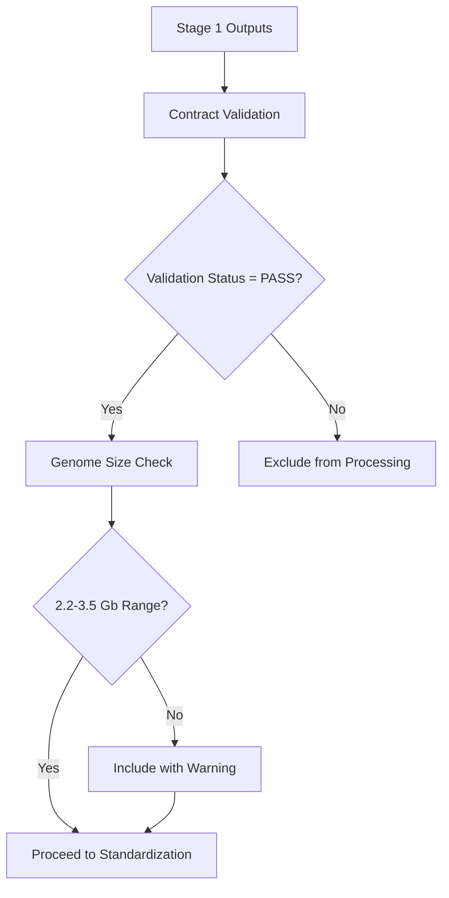

# Stage 2 Architecture: Genome Preprocessing & Indexing

## 🎯 Overview

Stage 2 transforms validated genomes from Stage 1 into analysis-ready, standardized datasets optimized for PGGB pangenome construction. This stage ensures all genomes are properly formatted, indexed, and quality-assessed before expensive pangenome graph construction.

## 📋 Input-Output Contracts

### **Stage 1 → Stage 2 Inputs**
```yaml
required_inputs:
  genomes: "results/01_data_preparation/downloaded_genomes/*.fa"
  metadata: "results/01_data_preparation/metadata/*.json"
  validation: "results/01_data_preparation/validation/*_validation.json"

validation_requirements:
  - validation_status: "PASS"
  - genome_size: 2.2-3.5 Gb (extended sheep range)
  - sequence_count: <100,000 contigs
  - basic_validation_complete: true
```

### **Stage 2 → Stage 3 Outputs**
```yaml
guaranteed_outputs:
  standardized_genomes: "results/02_preprocessing/standardized/*.fa"
  reference_genome: "results/02_preprocessing/reference_selection/selected_reference.fa"
  bwa_indices: "results/02_preprocessing/indices/bwa/*"
  minimap2_indices: "results/02_preprocessing/indices/minimap2/*"
  samtools_indices: "results/02_preprocessing/indices/samtools/*"

quality_outputs:
  qc_reports: "results/02_preprocessing/qc_reports/*.html"
  busco_results: "results/02_preprocessing/busco/*.json"
  extended_stats: "results/02_preprocessing/statistics/*.json"

traceability_outputs:
  chromosome_maps: "results/02_preprocessing/chromosome_mapping/*.tsv"
  header_maps: "results/02_preprocessing/header_mapping/*.tsv"
  processing_metadata: "results/02_preprocessing/metadata/*_preprocessed.json"
```

## 🏗️ Architecture Components

### **Main Orchestrator**
```
subworkflows/local/genome_preprocessing.nf
├── Input validation & contract enforcement
├── Four-phase processing pipeline
├── Quality gate assessment
└── Stage 2→3 readiness validation
```

### **Processing Phases**

#### **Phase 1: Standardization**
```
subworkflows/local/standardization.nf
├── modules/local/rename_chromosomes.nf     # Sheep chromosome naming (1-27, MT)
└── modules/local/normalize_headers.nf      # Clean FASTA headers
```

#### **Phase 2: Quality Control**
```
subworkflows/local/quality_control.nf
├── modules/local/genome_stats_extended.nf  # Comprehensive statistics
├── modules/local/busco_assessment.nf       # Gene space completeness
└── modules/local/generate_qc_report.nf     # HTML quality reports
```

#### **Phase 3: Indexing**
```
subworkflows/local/index_generation.nf
├── modules/local/create_bwa_index.nf       # BWA-MEM2 indices
├── modules/local/create_minimap2_index.nf  # Minimap2 indices
└── modules/local/create_samtools_index.nf  # FAIDX indices
```

#### **Phase 4: Reference Selection**
```
subworkflows/local/reference_selection.nf
└── modules/local/select_reference.nf       # Multi-criteria reference selection
```

## 🔄 Processing Workflow

### **1. Input Validation & Contract Enforcement**



**Validation Criteria:**
- ✅ `validation_status: "PASS"` from Stage 1
- ✅ Genome size within extended sheep range (2.2-3.5 Gb)
- ✅ Reasonable fragmentation level (<100K sequences)
- ✅ Acceptable gap content (<10% N's)

### **2. Phase 1: Genome Standardization**

#### **Chromosome Renaming Algorithm**
```python
def intelligent_chromosome_detection(seq_name, seq_length, sheep_mapping):
    """Multi-heuristic chromosome identification for sheep genomes"""

    # 1. Direct mapping check (exact matches)
    if seq_name in sheep_mapping:
        return sheep_mapping[seq_name], 'direct_mapping', 1.0

    # 2. Pattern-based detection
    patterns = [
        r'^chr(\d+)$',           # chr1, chr2, etc.
        r'^(\d+)$',              # 1, 2, etc.
        r'chromosome[_\s]+(\d+)', # chromosome_1, chromosome 2
        r'^(chr)?X$',            # X chromosome → chr27
        r'^(chr)?(MT|M|mito)',   # Mitochondrial → chrMT
    ]

    # 3. Size-based heuristics (sheep chromosome sizes)
    sheep_chr_sizes = {
        1: (275e6, 285e6), 2: (248e6, 252e6), ...
        27: (135e6, 145e6),  # X chromosome
    }

    # 4. Confidence scoring
    return new_name, method, confidence_score
```

#### **Header Normalization Process**
```python
def normalize_fasta_headers(header, sample_id):
    """Clean and standardize FASTA headers"""

    # Remove problematic characters
    clean_id = re.sub(r'[^a-zA-Z0-9_\-\.\|]', '_', header)

    # Create standardized description
    desc_parts = [
        clean_id,
        f"sample:{sample_id}",
        f"orig:{original_id}",  # Traceability
        metadata_tags  # Length, chromosome info, etc.
    ]

    return " | ".join(desc_parts)
```

### **3. Phase 2: Extended Quality Control**

#### **Quality Tier Assignment Algorithm**
```python
def calculate_quality_tier(genome_stats, busco_results):
    """Multi-criteria quality assessment"""

    score = 0

    # Assembly contiguity (30%)
    if scaffold_n50 > 50e6: score += 30
    elif scaffold_n50 > 10e6: score += 20
    elif scaffold_n50 > 1e6: score += 10

    # BUSCO completeness (40%)
    if busco_complete >= 95: score += 40
    elif busco_complete >= 90: score += 30
    elif busco_complete >= 80: score += 20

    # Sequence quality (20%)
    if n_content <= 0.5: score += 20
    elif n_content <= 1.0: score += 15
    elif n_content <= 2.0: score += 10

    # Size accuracy (10%)
    size_accuracy = 1 - abs(length - 2.8e9) / 2.8e9
    if size_accuracy >= 0.95: score += 10

    # Assign tier
    if score >= 85: return "A+"
    elif score >= 75: return "A"
    elif score >= 65: return "B+"
    elif score >= 50: return "B"
    else: return "C"
```

#### **BUSCO Assessment**
- **Lineage**: Mammalia (mammalia_odb10)
- **Metrics**: Complete, fragmented, missing, duplicated BUSCOs
- **Thresholds**:
  - A+ tier: ≥95% complete
  - A tier: ≥90% complete
  - B tier: ≥80% complete
  - C tier: ≥70% complete

### **4. Phase 3: Multi-Platform Indexing**

#### **BWA-MEM2 Indexing**
```bash
bwa-mem2 index -p ${prefix} ${genome}.fa
```
**Purpose**: Short-read alignment for validation and QC
**Files**: `.0123`, `.amb`, `.ann`, `.bwt.2bit.64`, `.pac`

#### **Minimap2 Indexing**
```bash
# Genome-to-genome alignment
minimap2 -x asm5 -d ${prefix}_asm5.mmi ${genome}.fa

# Long-read alignment modes
minimap2 -x map-ont -d ${prefix}_ont.mmi ${genome}.fa
minimap2 -x map-pb -d ${prefix}_pb.mmi ${genome}.fa
```
**Purpose**: Long-read and genome alignment for pangenome validation
**Files**: `_asm5.mmi`, `_ont.mmi`, `_pb.mmi`

#### **Samtools FAIDX**
```bash
samtools faidx ${genome}.fa
```
**Purpose**: Random sequence access for pangenome tools
**Files**: `.fa.fai`

### **5. Phase 4: Reference Genome Selection**

#### **Multi-Criteria Scoring System**
```yaml
selection_criteria:
  assembly_quality: 25      # Assembly level, contiguity (N50)
  completeness: 25          # BUSCO completeness, chromosome coverage
  sequence_quality: 20      # Gap content, size accuracy
  annotation_metadata: 15   # Annotation availability, RefSeq status
  reference_suitability: 15 # Breed representation, method, recency
```

#### **Selection Algorithm**
```python
def select_optimal_reference(candidates):
    """Multi-criteria reference genome selection"""

    scored_candidates = []

    for candidate in candidates:
        score = 0

        # Assembly Quality (25 points)
        if assembly_level == 'chromosome': score += 15
        if scaffold_n50 >= 50e6: score += 10

        # Completeness (25 points)
        if busco_complete >= 95: score += 20
        if chr_scaffolds >= 27: score += 5

        # Sequence Quality (20 points)
        if n_content <= 0.5: score += 10
        if size_accuracy >= 0.95: score += 10

        # Annotation & Metadata (15 points)
        if has_annotation: score += 10
        if is_refseq: score += 5

        # Reference Suitability (15 points)
        if breed in preferred_breeds: score += 8
        if method in modern_methods: score += 4
        if year >= 2020: score += 3

        scored_candidates.append((candidate, score))

    return max(scored_candidates, key=lambda x: x[1])
```

## 📊 Quality Assessment Framework

### **Quality Tiers**

| Tier | BUSCO Complete | N50 | Gap Content | Description |
|------|----------------|-----|-------------|-------------|
| A+ | ≥95% | ≥50 Mb | ≤1% | Excellent - reference quality |
| A | ≥90% | ≥20 Mb | ≤2% | High quality - suitable for reference |
| B+ | ≥85% | ≥10 Mb | ≤3% | Good quality - pangenome ready |
| B | ≥80% | ≥5 Mb | ≤4% | Adequate - basic pangenome use |
| C+ | ≥75% | ≥1 Mb | ≤5% | Fair - limited applications |
| C | ≥70% | ≥500 Kb | ≤6% | Poor - careful consideration needed |

### **Stage 2→3 Quality Gates**

#### **Pass Criteria (STAGE GATE: PASSED)**
- ✅ ≥3 genomes successfully processed
- ✅ ≥1 Tier A or A+ reference selected
- ✅ All genomes have complete indices
- ✅ <20% failure rate in processing

#### **Warning Criteria (STAGE GATE: WARNING)**
- ⚠️ 1-2 genomes ready for pangenome
- ⚠️ No Tier A reference (best available used)
- ⚠️ 20-50% failure rate in processing

#### **Failure Criteria (STAGE GATE: FAILED)**
- ❌ <1 genome ready for pangenome
- ❌ No suitable reference identified
- ❌ >50% failure rate in processing

## 🗂️ File Organization

```
results/02_preprocessing/
├── standardized/              # Standardized genomes ready for PGGB
│   ├── sample1_standardized.fa
│   └── sample2_standardized.fa
├── indices/
│   ├── bwa/                   # BWA-MEM2 indices
│   │   ├── sample1_bwa_index/
│   │   └── sample2_bwa_index/
│   ├── minimap2/              # Minimap2 indices
│   │   ├── sample1_minimap2_index/
│   │   └── sample2_minimap2_index/
│   └── samtools/              # Samtools FAIDX indices
│       ├── sample1_samtools_index/
│       └── sample2_samtools_index/
├── reference_selection/       # Selected reference genome
│   ├── selected_reference.fa
│   ├── reference_metadata.json
│   └── reference_selection_report.json
├── qc_reports/               # Interactive HTML QC reports
│   ├── sample1_qc_report.html
│   └── sample2_qc_report.html
├── statistics/               # Extended genome statistics
│   ├── sample1_extended_stats.json
│   └── sample2_extended_stats.json
├── busco/                    # BUSCO completeness results
│   ├── sample1_busco_summary.json
│   └── sample2_busco_summary.json
├── chromosome_mapping/       # Chromosome renaming traceability
│   ├── sample1_chromosome_mapping.tsv
│   └── sample2_chromosome_mapping.tsv
└── metadata/                 # Processing metadata
    ├── sample1_preprocessed.json
    └── sample2_preprocessed.json
```

## ⚙️ Configuration

### **Resource Requirements**

| Process | CPU | Memory | Time | Notes |
|---------|-----|--------|------|-------|
| Chromosome Renaming | 2 | 8 GB | 4h | Light processing |
| Header Normalization | 1 | 4 GB | 2h | Text processing |
| Extended Statistics | 4 | 16 GB | 8h | Computational analysis |
| BUSCO Assessment | 16 | 32 GB | 24h | CPU intensive |
| BWA Indexing | 8 | 32 GB | 12h | Memory intensive |
| Minimap2 Indexing | 8 | 24 GB | 8h | Moderate resources |
| Samtools Indexing | 1 | 4 GB | 2h | Light processing |
| Reference Selection | 2 | 8 GB | 2h | Analysis only |

### **Scaling Parameters**
```groovy
// Memory scaling based on genome size
memory_per_gb = 4.GB
scaled_memory = base_memory + (genome_size_gb * memory_per_gb)

// CPU scaling based on genome count
max_parallel_busco = Math.min(3, Math.floor(total_cpus / 16))
max_parallel_indexing = Math.min(5, Math.floor(total_cpus / 8))
```

## 🚀 Usage Examples

### **Run Stage 2 After Stage 1**
```bash
# Continue from successful Stage 1
nextflow run . --stage 2 --input samplesheet.csv -profile slurm,singularity

# With Stage 2 specific options
nextflow run . --stage 2 \
    --input samplesheet.csv \
    --enable_busco_assessment true \
    --busco_threads 32 \
    --parallel_indexing true \
    -profile slurm,singularity
```

### **Standalone Stage 2 Testing**
```bash
# Test Stage 2 with existing Stage 1 outputs
nextflow run workflows/stage2_preprocessing.nf \
    --outdir results \
    -profile test,docker

# Custom quality thresholds
nextflow run workflows/stage2_preprocessing.nf \
    --min_busco_completeness 80 \
    --min_reference_score 70 \
    -profile slurm,singularity
```

### **Quality-Focused Run**
```bash
nextflow run . --stage 2 \
    --enable_busco_assessment true \
    --busco_lineage mammalia_odb10 \
    --strict_quality_mode true \
    --generate_html_reports true \
    -profile slurm,singularity
```

## 🔍 Quality Control Reports

### **Interactive HTML Reports**
Each genome receives a comprehensive QC report with:

- **Overall Quality Score** (0-100) with color coding
- **Assembly Statistics** (N50, total length, sequence count)
- **Quality Assessment** (progress bars for key metrics)
- **Nucleotide Composition** (GC/AT/N content analysis)
- **BUSCO Results** (completeness visualization)
- **Chromosome Candidates** (largest sequences identified)
- **Recommendations** (quality-based guidance)

### **Quality Dashboard Elements**
```html
<!-- Overall quality score with color coding -->
<div class="quality-score" style="background: {green|blue|yellow|red}">
    <h2>Overall Quality Score</h2>
    <div class="score">87.3/100</div>
    <div class="tier">Excellent</div>
</div>

<!-- Interactive progress bars -->
<div class="progress-bar" data-value="95.2" data-label="BUSCO Completeness">
<div class="progress-bar" data-value="78.1" data-label="Contiguity Score">
```

## 🧪 Testing & Validation

### **Stage 2 Test Suite**
```bash
# Quick validation test (3 genomes)
nextflow run . --stage 2 -profile test

# Full integration test
nextflow run . --stage 2 -profile test_full

# Resource scaling test
nextflow run . --stage 2 -profile test_large
```

### **Quality Validation Checks**
- ✅ All standardized genomes have sheep chromosome naming
- ✅ Headers are properly normalized and traceable
- ✅ All quality statistics are computed and reasonable
- ✅ BUSCO assessments complete successfully
- ✅ All three index types created for each genome
- ✅ Reference selection produces valid choice
- ✅ QC reports generate without errors

## 🚨 Troubleshooting

### **Common Issues**

#### **BUSCO Failures**
```bash
# Check BUSCO logs
ls work/*/*/.command.log | grep -i busco

# Common causes:
# - Insufficient memory (increase to 64GB)
# - Download failures (check network/proxy)
# - Corrupted lineage data (delete and re-download)
```

#### **Indexing Failures**
```bash
# BWA indexing memory issues
# Solution: Increase memory allocation
params.bwa_index_memory = '64.GB'

# Minimap2 failures
# Solution: Check genome file integrity
samtools faidx genome.fa  # Should complete without errors
```

#### **Reference Selection Issues**
```bash
# No suitable reference found
# Check genome quality distribution
grep -r "quality_tier" work/*/reference_selection/

# All genomes Tier C or lower
# Solution: Lower minimum reference score or improve input quality
```

### **Performance Optimization**

#### **Resource Tuning**
```groovy
// High-memory cluster
params.stage2_max_memory = '500.GB'
params.busco_memory = '128.GB'

// Many-core cluster
params.busco_threads = 64
params.max_concurrent_busco = 6

// Fast storage
params.enable_stage2_checkpoints = false
params.parallel_indexing = true
```

#### **Processing Optimization**
```bash
# Skip time-intensive analyses for testing
--skip_busco_assessment
--skip_html_reports

# Parallel processing limits
--max_concurrent_standardization 20
--max_concurrent_indexing 10
```

## 📈 Expected Performance

### **Processing Time Estimates**

| Genome Count | Total Time | Peak Memory | CPU Hours |
|-------------|------------|-------------|-----------|
| 5 genomes | 8-12 hours | 150 GB | 200 |
| 15 genomes | 18-24 hours | 200 GB | 600 |
| 30 genomes | 30-40 hours | 300 GB | 1200 |
| 50+ genomes | 48-72 hours | 400 GB | 2000+ |

### **Resource Scaling Guidelines**

#### **Small Dataset (≤10 genomes)**
- Memory: 150-200 GB total
- CPUs: 32-64 cores
- Storage: 500 GB
- Time: 8-16 hours

#### **Medium Dataset (11-30 genomes)**
- Memory: 200-300 GB total
- CPUs: 64-128 cores
- Storage: 1-2 TB
- Time: 24-48 hours

#### **Large Dataset (31+ genomes)**
- Memory: 300-500 GB total
- CPUs: 128-256 cores
- Storage: 2-5 TB
- Time: 48-96 hours

## ✅ Success Criteria

### **Stage 2 Completion Checklist**

#### **Processing Success**
- [ ] All input genomes processed through standardization
- [ ] Chromosome naming applied consistently
- [ ] Headers normalized with traceability maintained
- [ ] Extended statistics computed for all genomes
- [ ] BUSCO assessments completed (if enabled)
- [ ] Quality tier assignment completed
- [ ] All three index types created successfully

#### **Quality Validation**
- [ ] ≥80% of genomes achieve Tier B or better
- [ ] At least one Tier A genome for reference use
- [ ] Reference selection completed successfully
- [ ] QC reports generated without errors
- [ ] All processing metadata captured

#### **Output Validation**
- [ ] Standardized genomes in proper format
- [ ] All indices functional and complete
- [ ] Reference genome identified and validated
- [ ] Chromosome mapping files accurate
- [ ] Processing metadata complete

#### **Stage Gate Criteria**
- [ ] ≥3 genomes ready for pangenome construction
- [ ] Reference genome suitable for PGGB (score ≥70)
- [ ] <20% failure rate in processing pipeline
- [ ] All critical outputs present and validated

---

**🎯 Stage 2 Success = Analysis-Ready Genome Collection for High-Quality Pangenome Construction**